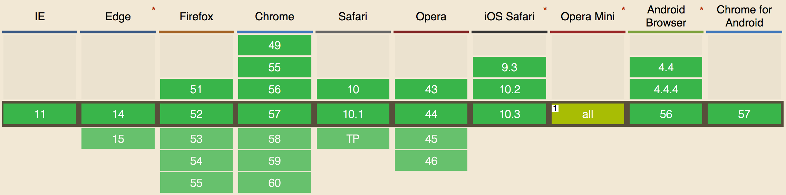

　　关于apply()和call()方法，老生常谈。他们的使用和区别网上一搜一大堆，但是结果稂莠不齐，果然还得靠自己动手。
　　apply()和call()方法是每个函数都包含的两个非继承而来的方法。这个两个方法的用途都是**在特定的作用域中调用函数，实际上等于设置函数体内this对象的值**。
<!-- more -->
### apply()
　　apply()方法接受两个参数：**一个是在其中运行的函数的作用域，另一个是参数数组**。其中，第二个参数可以是Array的实例，也可以是arguments对象。例如：
```
function sum(num1, num2) {
	return num1 + num2;
}

function callSum1(num1, num2) {
	return sum.apply(this, arguments);   //传入arguments对象
}

function callSum2(num1, num2) {
	return sum.apply(this, [num1, num2]);  //传入数组
}

alert(callSum1(10, 10));  //20
alert(callSum2(10, 10));  //20
```
　　在上面的例子中，callSum1()在执行sum()函数时传入了this作为this值（因为在全局作用域中调用的，在非严格模式下传入的就是windows对象）和arguments对象。而callSum2同样调用了sum()函数，但它传入的则是this和一个参数数组。这两个函数都会正常执行并返回正确的结果。
### call()
　　call()方法与apply()方法的**作用相同，它们的区别仅在于接收参数的方式不同**。对于call()方法而言，第一个参数是this值没有变化，变化的是其余参数都直接传递给函数。换句话说，在使用call()方法时，传递给函数的参数必须逐个列举出来，如：
```
function sum(sum1, sum2) {
	return num1 + num2;
}
function callSum(sum1, sum2) {
	return sum.call(this, num1, num2);
}
alert(callSum(10, 10));  //20
```
　　在使用call()方法的情况下，callSum()必须明确地传入每一个参数。结果与使用apply()**没有什么不同**。这两个方法使用哪一个完全取决于采用哪种给函数传递参数的方式最方便。在不给函数传递参数的情况下，使用哪个方法都无所谓。
### 真正的用武之地
　　传递参数并非apply()和call()真正的用武之地，它们真正强大的地方是**能够扩充函数赖以运行的作用域**。看例子：
```
window.color = 'red';
var o = {color: 'blue'};

function sayColor() {
	alert(this.color);
}

sayColor();               //red

sayColor.call(this);      //red
sayColor.call(window);    //red　　
sayColor.call(o);         //blue
```
　　sayColor()是作为全局函数定义的，而且当在全局作用域中调用它时，它确实会显示'red'————因为对this.color的求值会转换成对window.color的求值。而sayColor.call(this)和sayColor.call(window)，则是两种显式地在全局作用域中调用函数的方式，结果当然都会显示'red'。但是，当运行sayColor.call(o)时，函数的执行环境就不一样了，因为此时函数体内的this对象指向了o，于是结果显示的是'blue'。
　　使用call()或者apply()来扩充作用域的最大好处，就是对象不需要与方法有任何耦合关系。
### bind()
　　bind()方法是在ECMAScript5中定义的一个方法。这个方法会创建一个函数的实例，其中this值会被绑定到传给bind()函数的值。例如：
```
window.color = 'red';
var o = {color: 'blue'};

function sayColor() {
	alert(this.color);
}

var objectSayColor = sayColor.bind(o);
objectSayColor();    //blue
```
　　在这里，sayColor()调用bind()并传入对象o，创建了objectSayColor()函数。objectSayColor()函数的this值等于o，因此即使是在全局作用域中调用这个函数，也会看到'blue'。
　　bind()方法的浏览器兼容性如下：


　　
　　*<small>参考书籍：[《JavaScript高级程序设计（第三版）》，Professional JavaScript for Web Developers 3rd Edition，作者: Nicholas C.Zakas ](https://book.douban.com/subject/10546125/)*

